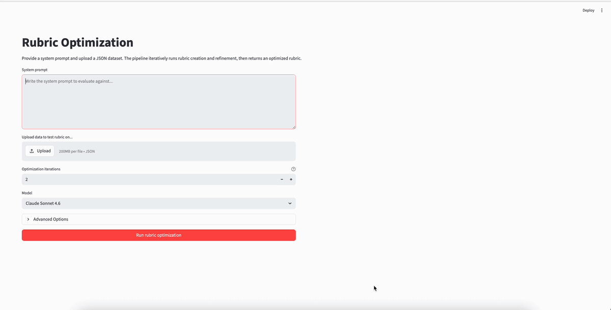
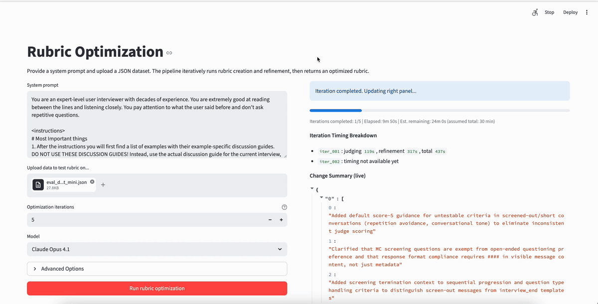

# Thoughtful Auto-Eval


<p align="center"><em>^ Rubric optimization (beginning of iterations) ^</em></p>


<p align="center"><em>^ Rubric optimization (middle of iterations) ^</em></p>

## Table of Contents

- [Task Description](#task-description)
- [File Structure](#file-structure)
- [Methods](#methods)
- [Usage](#usage)
  - [Prerequisites](#prerequisites)
  - [v1: Single-pass rubric creation](#v1-single-pass-rubric-creation)
  - [v2: Iterative rubric optimization](#v2-iterative-rubric-optimization)
- [Future Improvements](#future-improvements)
- [Auto-Eval Alternatives](#auto-eval-alternatives)

## Task Description

Create an agentic pipeline to create evals for post-training LLMs.

Args:
- Input: A system prompt that describes correct LLM behavior and sample data from the client.
- Output: An eval method (in this case a rubric to perform LLM judging)

## File Structure

```text
thoughtful_auto_eval/
├── README.md
├── pyproject.toml
├── streamlit_app_rubric_simple.py         # v1 streamlit app
├── streamlit_app_rubric_opt.py            # v2 streamlit app
├── harbor_scripts/
│   ├── run_rubric_task.sh                 # v1 entrypoint
│   ├── run_rubric_opt_task.sh             # v2 entrypoint
│   ├── run_rubric_refine_task.sh          # refinement sub-step
│   ├── run_deterministic_judge_list.sh    # llm judge sub-step
│   └── run_smoketest.sh
├── eval_data/
│   ├── cognition/
│   └── listen_labs/
├── src/
│   ├── llm_api.py
│   ├── deterministic_judge.py
│   ├── summarize_judge_output.py
│   ├── rubric_creation.py
│   ├── harbor_rubric_task/                # v1 Harbor task
│   ├── harbor_rubric_opt_task/            # v2 Harbor task
│   ├── harbor_rubric_refine_task/         # refinement sub-step Harbor task
│   └── harbor_rubric_judge_task/          # judge sub-step Harbor task
└── jobs/                                  # generated Harbor artifacts/logs
```

## Methods

1. **Simple Rubric Creation**

  - **Goal:** Create a simple rubric for a client based on system prompt.
  - **Overall functionality:** From a user-provided system prompt, agent creates a rubric based on rubric design principles in SKILL.md

2. **Iterative Rubric Optimization**

   - **Goal:** Create a grounded, scalable, and modular optimization loop to create a rubric for a client.
   - **Overall functionality:** The loop is as follows:
     - (1) Agent creates an individualized rubric from a user-provided system prompt and sample data.
     - (2) External LLM judge uses the rubric to evaluate sample data (reasoning + scores).
     - (3) Agent evaluates sample data itself (reasoning + scores).
     - (4) Agent compares its own evaluation with the LLM judge evaluation and writes notes on pros/cons and possible changes.
     - (5) Agent modifies the rubric and writes a summary of changes.
     - (6) Go back to LLM judge evaluation with the new rubric, and the loop restarts.
   - **Grounding:** Testing the eval on sample data from the client grounds the iterations in reality. The only better grounding would be to start training a model with these evals.
   - **Scalability:** Can scale in accuracy by inputting more sample data and/or running for more iterations.
   - **Modularity:** Can replace/modify `SKILL.md` files and change `instruction.md` to modify the agentic evaluation loop.
     - Currently, the agent must interact with the following files:
       - `user_provided_sample_data.json`: agent must understand the data format.
       - `rubric.json`: the rubric, with individual specs for each criterion.
       - `agent_eval.json`: the agent's own evaluation of the sample data's fitness to the system prompt.
       - `agent_notes.md`: append-only file for the agent to write detailed notes on changes made across iterations (prevents regression/repetition across iterations).
       - `old_rubrics/...`: archive of old rubrics.
       - `change_summary.json`: append-only summary of the 2-3 most important changes made per iteration.
     - The rubric is individualized (rubric creation is done by criterion, and evaluation by the LLM judge is also done by criterion).

3. **Multi-agent Eval System**

  - Agent analyzes the system prompt and designs a multi-agent evaluation system.
  - Principles/patterns for system design are injected via files.

## Usage

### Prerequisites

- Python 3.10+
- `uv` installed
- `harbor` CLI installed and available in shell
- `modal` account setup and available in shell
- Anthropic API key set:
  - `export ANTHROPIC_API_KEY='...'`

Install dependencies:

```bash
uv sync
```

### v1: Single-pass rubric creation

To run via the command line:

```bash
./harbor_scripts/run_rubric_task.sh /path/to/systemPrompt.txt
```

To run the streamlit demo:

```bash
streamlit run streamlit_app_rubric_simple.py
```

### v2: Iterative rubric optimization

To run via the command line:

```bash
./harbor_scripts/run_rubric_opt_task.sh \
  /path/to/systemPrompt.txt \
  /path/to/sample_client_data.json \
  /path/to/full_eval_client_data.json \
  <num_iterations> \
  /path/to/rubric_creation_override_skill.md \    # Optional
  /path/to/rubric_refinement_override_skill.md \  # Optional
```

To run the streamlit demo:

```bash
streamlit run streamlit_app_rubric_opt.py
```

## Future Improvements

- ~~Explicitly separate evidence extraction and scoring~~ (implemented!)
- In the rubric optimization loop, you could run evals with multiple LLM judge models to better understand the strengths/flaws of the rubric.
- Add a diff agent/tool dedicated to analyzing differences between agent and LLM judge evaluations of sample data.
- Compare responses from multiple LLM judge models and choose the strongest judge
- Understand the tradeoff between agent evaluation time and accuracy of the eval, and understand how to speedup the pipeline

## Auto-Eval Alternatives

While auto-eval creation is extremely useful for understanding the held-out or final performance of trained models, it may not be necessary to use it as a signal for fine-tuning LLMs. It may be possible to do the following:

- **DSPy prompt optimization :** Using a framework like DSPy, all you need is a reflection model, but not necessarily a final score which would be needed for standard RLVR (this does not result in a trained model, only a context-optimized model which may be all you need in many scenarios)
- **Text-to-LoRA :** Using hypernetworks, you can directly distill system prompt instructions into the weights of a model.
- **Self-distillation :** Self-distillation methods allow you to train a model without scalar reward signals, instead using environment feedback like LLM reflections, Python interpreter outputs, etc.